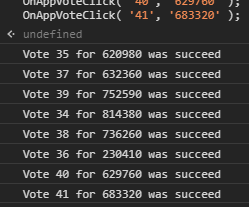

# Steam vote helper

This version will work only with `THE STEAM AWARDS`. 2020 year.

1. Just open your favourite browser
2. Navigate [here](https://store.steampowered.com/steamawards) and login if not yet logged in
3. Open browser console (in most browsers it should be `F12` key on your keyboard)
4. Copy following code to browser console and press `Enter`  
```js
if (g_bIsLimitedAccoun) {
	ShowAlertDialog( 'Error', 'It appears that your account is limited. To prevent nomination abuse, you must spend $5 USD on Steam in order to participate in the Steam Awards. Visit <a href="https://support.steampowered.com/kb_article.php?ref=3330-IAGK-7663" target="_blank" rel="noreferrer">Steam Support</a> for more info.' );
	return;
}

var sessionId = WebStorage.GetCookie("sessionid");

function OnAppVoteClick(categoryid, nominatedid, source) {
	$J
	.post('https://store.steampowered.com/salevote', {sessionid: sessionId, categoryid: categoryid, nominatedid: nominatedid, source: source })
	.done(function(data) {
		console.info('Vote for ' + nominatedid + ' was succeed');
	})
	.fail(function() {
		console.error('Vote for ' + nominatedid + ' was FAILED');
	}) 
};
OnAppVoteClick( '61', '1293830', '2' );
OnAppVoteClick( '62', '752480', '3' );
OnAppVoteClick( '63', '620', '2' );
OnAppVoteClick( '64', '1293830', '2' );
OnAppVoteClick( '65', '1293830', '2' );
OnAppVoteClick( '66', '1091500', '2' );
OnAppVoteClick( '67', '1293830', '2' );
OnAppVoteClick( '68', '1091500', '2' );
OnAppVoteClick( '69', '1091500', '2' );
OnAppVoteClick( '70', '1293830', '2' );
```

---

Output will be like this:  


# Something like license
You're all free to copy, distribute, edit and do what you want with this but leave credits.
